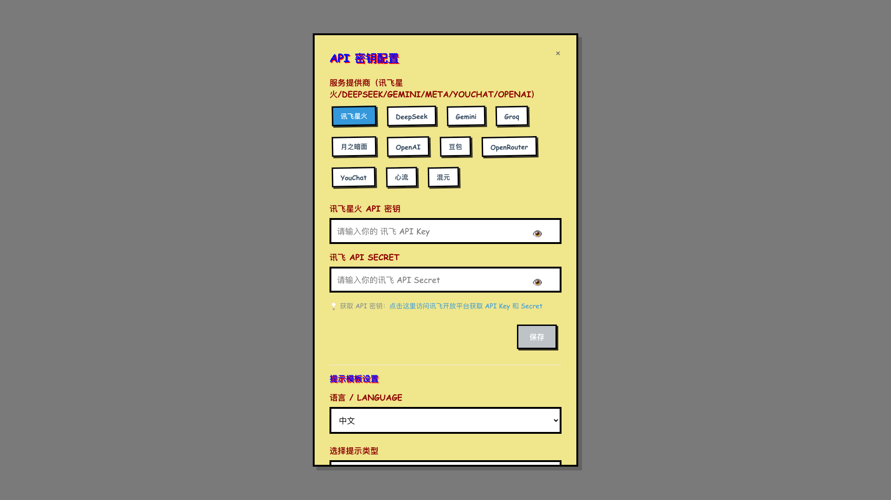

# LLM Service Provider

[English Document](README_EN.md)

一个提供多种 LLM（大型语言模型）服务集成的前端组件库，支持 DeepSeek、Gemini、Groq、讯飞星火和 YouChat 等服务提供商。

## 最新版本更新（v3.1.10）

- **新增豆包服务支持**：集成了豆包（Doubao）大语言模型服务，用户可以通过配置豆包API密钥来使用该服务
- **样式重构**：将ApiKeyManager组件中的所有内联样式移动到CSS文件中，使代码结构更清晰，便于维护
- **主题样式支持**：新增基于Comic Sans MS字体的两种样式方案（活泼卡通风格和复古漫画风格）
- **样式切换功能**：通过styleVariant属性支持在默认样式、comic1和comic2样式之间切换
- **多语言支持**：支持中英文切换功能，所有界面文本和提示模板都可以根据用户选择的语言进行动态切换
- **CSS文件打包修复**：修复了CSS文件未被正确打包到dist目录的问题，确保样式文件能够正常工作

## 功能展示

### LLM 服务集成 思维导图可视化



示例：
 - [Revelation](https://github.com/qcgm1978/revelation)
 - [Psychotherapy](https://github.com/qcgm1978/psychotherapy)

## 安装

```bash
npm install llm-service-provider
# 或
pnpm add llm-service-provider
# 或
 yarn add llm-service-provider
```

## 使用方法

### 1. 使用 API 密钥管理组件

```tsx
import React, { useState } from 'react'
import { ApiKeyManager } from 'llm-service-provider'

function App() {
  const [isApiKeyManagerOpen, setIsApiKeyManagerOpen] = useState(false)
  const [apiKey, setApiKey] = useState('')

  const handleSaveApiKey = (key: string) => {
    setApiKey(key)
    console.log('API key saved:', key)
  }

  return (
    <div>
      <button onClick={() => setIsApiKeyManagerOpen(true)}>
        配置 API 密钥
      </button>
      
      <ApiKeyManager
        isOpen={isApiKeyManagerOpen}
        onSave={handleSaveApiKey}
        onClose={() => setIsApiKeyManagerOpen(false)}
        language="zh" // 设置为"zh"使用中文界面，设置为"en"使用英文界面
        styleVariant="default" // 可选值："default"（默认样式）、"comic1"（活泼卡通风格）、"comic2"（复古漫画风格）
      />
    </div>
  )
}

export default App
```

### 2. 使用流式内容生成

```tsx
import React, { useState, useEffect, useRef } from 'react'
import { streamDefinition, getSelectedServiceProvider, hasApiKey } from 'llm-service-provider'

function ContentGenerator({ topic }: { topic: string }) {
  const [content, setContent] = useState('')
  const [isGenerating, setIsGenerating] = useState(false)
  const controllerRef = useRef<AbortController | null>(null)

  useEffect(() => {
    if (!topic || !hasApiKey()) return

    const generateContent = async () => {
      setIsGenerating(true)
      setContent('')
      controllerRef.current = new AbortController()
      const signal = controllerRef.current.signal

      try {
        const provider = getSelectedServiceProvider()
        const generator = streamDefinition(topic, 'zh', undefined, undefined)
        
        for await (const chunk of generator) {
          if (signal.aborted) break
          setContent(chunk)
        }
      } catch (error) {
        console.error('Error generating content:', error)
        setContent(`生成内容时出错: ${error instanceof Error ? error.message : '未知错误'}`)
      } finally {
        setIsGenerating(false)
      }
    }

    generateContent()

    return () => {
      if (controllerRef.current) {
        controllerRef.current.abort()
      }
    }
  }, [topic])

  return (
    <div>
      {isGenerating && <p>生成中...</p>}
      <div>{content}</div>
    </div>
  )
}

export default ContentGenerator
```

### 3. 服务提供商管理

```javascript
import {
  ServiceProvider,
  getSelectedServiceProvider,
  setSelectedServiceProvider,
  hasApiKey
} from 'llm-service-provider'

// 获取当前选中的服务提供商
const currentProvider = getSelectedServiceProvider()
console.log('当前选中的服务提供商:', currentProvider)

// 选择特定的服务提供商
setSelectedServiceProvider(ServiceProvider.GEMINI)

// 检查是否已配置任何 API 密钥
const hasKey = hasApiKey()
console.log('是否已配置 API 密钥:', hasKey)
```

## 4. 使用Demo示例

项目包含一个完整的演示应用程序，位于`demo`文件夹中。这个演示应用展示了库的所有主要功能，包括API密钥配置、服务提供商选择、内容生成、思维导图创建和可视化。

### 运行演示应用

```bash
# 进入demo目录
cd demo

# 安装依赖
npm install

# 启动开发服务器
npm run dev
```

### 演示应用功能

演示应用包含以下功能模块：

1. **API Key配置**：通过ApiKeyManager组件设置各服务提供商的API密钥
2. **服务提供商选择**：在DeepSeek、Gemini、Groq、讯飞星火和YouChat之间切换
3. **内容生成**：基于输入的主题生成相关内容
4. **思维导图生成**：从生成的内容创建思维导图数据
5. **箭头连接生成**：为思维导图添加有意义的连接箭头
6. **思维导图可视化**：使用MindMapVisualizer组件展示生成的思维导图
7. **原始提示文本展示**：查看用于生成思维导图和箭头的原始提示文本
8. **多语言支持**：支持中英文界面切换
9. **主题样式切换**：支持在默认样式、活泼卡通风格和复古漫画风格之间切换

## 支持的服务提供商

- DeepSeek
- Gemini
- Groq (Meta) - (需代理)
- 讯飞星火
- YouChat - 默认服务，无需API密钥可免费使用
- 豆包 - 支持豆包大语言模型服务

## 浏览器兼容性

该模块支持所有现代浏览器，使用 localStorage 存储 API 密钥和用户偏好设置。

## 构建和发布

### 开发构建

项目使用 TypeScript 开发，构建命令如下：

```bash
# 安装依赖
npm install

# 构建项目
npm run build

# 构建结果会输出到 dist 目录
```

### 版本发布流程

项目使用 GitHub Actions 实现自动发布到 npmjs。发布流程如下：

1. 版本更新和标签创建：
   ```bash
   # 更新补丁版本 (v1.0.x)
   npm run publish:patch
   
   # 更新次要版本 (v1.x.0)
   npm run publish:minor
   
   # 更新主要版本 (vx.0.0)
   npm run publish:major
   ```

2. 自动发布机制：
   - 当推送符合 `v*.*.*` 格式的标签到 GitHub 时，GitHub Actions 会自动触发构建和发布流程
   - Actions 会在 Ubuntu 环境中使用 Node.js 18 运行构建和发布命令
   - 发布过程中会使用 `NPM_TOKEN` 环境变量进行身份验证

3. 测试发布：
   ```bash
   # 执行测试发布，不会实际发布到 npmjs
   npm run publish:dry
   ```

## License

MIT