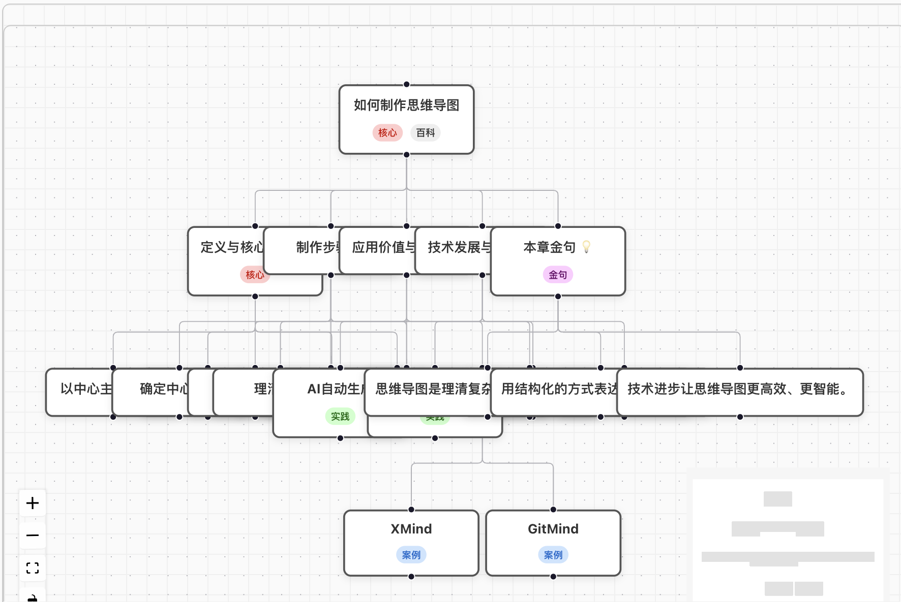

# LLM Service Provider

A Node.js module that integrates multiple LLM (Large Language Model) services, supporting DeepSeek, Gemini, Groq, Xunfei Xinghuo, and YouChat service providers.

## Feature Showcase

### LLM Service Integration


### Mind Map Visualization



Example: 
 - [Revelation](https://github.com/qcgm1978/revelation)
 - [Psychotherapy](https://github.com/qcgm1978/psychotherapy)

## Installation

```bash
npm install llm-service-provider
# or
pnpm add llm-service-provider
# or
 yarn add llm-service-provider
```

## Usage

### 1. Using API Key Management Component

```tsx
import React, { useState } from 'react'
import { ApiKeyManager } from 'llm-service-provider'

function App() {
  const [isApiKeyManagerOpen, setIsApiKeyManagerOpen] = useState(false)
  const [apiKey, setApiKey] = useState('')

  const handleSaveApiKey = (key: string) => {
    setApiKey(key)
    console.log('API key saved:', key)
  }

  return (
    <div>
      <button onClick={() => setIsApiKeyManagerOpen(true)}>
        Configure API Key
      </button>
      
      <ApiKeyManager
        isOpen={isApiKeyManagerOpen}
        onSave={handleSaveApiKey}
        onClose={() => setIsApiKeyManagerOpen(false)}
      />
    </div>
  )
}

export default App
```

### 2. Using Streaming Content Generation

```tsx
import React, { useState, useEffect, useRef } from 'react'
import { streamDefinition, getSelectedServiceProvider, hasApiKey } from 'llm-service-provider'

function ContentGenerator({ topic }: { topic: string }) {
  const [content, setContent] = useState('')
  const [isGenerating, setIsGenerating] = useState(false)
  const controllerRef = useRef<AbortController | null>(null)

  useEffect(() => {
    if (!topic || !hasApiKey()) return

    const generateContent = async () => {
      setIsGenerating(true)
      setContent('')
      controllerRef.current = new AbortController()
      const signal = controllerRef.current.signal

      try {
        const provider = getSelectedServiceProvider()
        const generator = streamDefinition(topic, 'en', undefined, undefined)
        
        for await (const chunk of generator) {
          if (signal.aborted) break
          setContent(chunk)
        }
      } catch (error) {
        console.error('Error generating content:', error)
        setContent(`Error generating content: ${error instanceof Error ? error.message : 'Unknown error'}`)
      } finally {
        setIsGenerating(false)
      }
    }

    generateContent()

    return () => {
      if (controllerRef.current) {
        controllerRef.current.abort()
      }
    }
  }, [topic])

  return (
    <div>
      {isGenerating && <p>Generating...</p>}
      <div>{content}</div>
    </div>
  )
}

export default ContentGenerator
```

### 3. Service Provider Management

```javascript
import {
  ServiceProvider,
  getSelectedServiceProvider,
  setSelectedServiceProvider,
  hasApiKey
} from 'llm-service-provider'

// Get the currently selected service provider
const currentProvider = getSelectedServiceProvider()
console.log('Current selected service provider:', currentProvider)

// Select a specific service provider
setSelectedServiceProvider(ServiceProvider.GEMINI)

// Check if any API key is configured
const hasKey = hasApiKey()
console.log('Has API key configured:', hasKey)
```

## 4. Using the Demo Example

The project includes a complete demonstration application located in the `demo` folder. This demo showcases all the main features of the library, including API key configuration, service provider selection, content generation, mind map creation, and visualization.

### Running the Demo Application

```bash
# Navigate to the demo directory
cd demo

# Install dependencies
npm install

# Start the development server
npm run dev
```

### Demo Application Features

The demo application includes the following functional modules:

1. **API Key Configuration**: Set up API keys for various service providers using the ApiKeyManager component
2. **Service Provider Selection**: Switch between DeepSeek, Gemini, Groq, Xunfei Xinghuo, and YouChat
3. **Content Generation**: Generate content based on the input topic
4. **Mind Map Generation**: Create mind map data from the generated content
5. **Arrow Connection Generation**: Add meaningful connection arrows to the mind map
6. **Mind Map Visualization**: Display the generated mind map using the MindMapVisualizer component
7. **Raw Prompt Display**: View the original prompt texts used for generating mind maps and arrows

## Supported Service Providers

- DeepSeek
- Gemini
- Groq (Meta)
- Xunfei Xinghuo
- YouChat

## Browser Compatibility

This module supports all modern browsers and uses localStorage to store API keys and user preferences.

## Build and Publish

### Development Build

```bash
npm install
npm run build
```

### Version Release Process

#### Automatic Version Update and Publishing

The project provides several npm scripts to simplify the version update and publishing process:

```bash
# Update patch version (e.g., 1.0.0 -> 1.0.1)
npm run publish:patch

# Update minor version (e.g., 1.0.1 -> 1.1.0)
npm run publish:minor

# Update major version (e.g., 1.1.0 -> 2.0.0)
npm run publish:major
```

These scripts will automatically:
1. Update the version number in package.json
2. Create a git commit with the version bump
3. Create a git tag with the new version
4. Push the commit and tag to the repository
5. Trigger GitHub Actions to publish the package to npmjs.com

#### GitHub Actions Automatic Publishing

The project uses GitHub Actions workflows to automatically build and publish the package to npmjs.com whenever a new version tag is pushed.

#### Test Publishing

For testing the publishing process without actually publishing to npmjs.com:

```bash
npm run publish:dry
```

## License

MIT